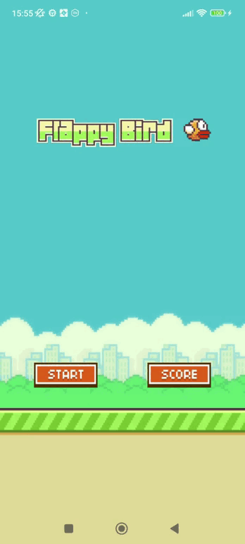

**[Readme на русском языке](README_RU.md)**  
  
[Dev blog in Telegram (ENG/RU)](https://t.me/boevdev)

# Flappy Bird, only C, without Java/Kotlin, weight APK (armeabi-v7a + arm64-v8a) < 100 kilobytes

## History:  
  
It all started in 2021. Then I came across the [rawdrawandroid](https://github.com/cnlohr/rawdrawandroid) repository. 
There was a motivation to make some kind of game with the lowest possible APK weight, but at the same time, so that the game would be simple and understandable.  
At that moment, the idea came up to make a clone of the long-forgotten Flappy Bird game. Which has already been ported to many programming languages.  
Then, later in 2021, I found another interesting repository [Raylib](https://github.com/raysan5/raylib).  
But, the first attempt to make this game was in C++, using [ImGui](https://github.com/ocornut/imgui/), because I already knew him.  
And so, all the difficulties were presented in Android Native Activity and building a clean APK from apktool without Android Studio.  
The first attempt failed.  
Firstly, the weight of the APK was about 1 Megabyte.  
Secondly, there could be crashes of the game.  
Thirdly, there was only a library for armeabi-v7a inside the APK, and since 2022 Google's rules require the presence of arm64-v8a libraries.  
Fourthly, the structure of the project and its organization were terrible, it created a mess in the eyes and made it difficult to navigate the project normally.  
In general, I tried something, it didn't work out, the thought was stored in my head throughout this time, but no more attempts were made.  

## Motivation:  
  
Around September 14, 2024, in the Raylib discord channel, I saw a guy make a Flappy Bird in C#.  
Then it became very interesting to me to try a crazy idea, to make this game in C, for Android, with an APK weighing less than 100 Kilobytes.
The idea seemed crazy, as well as unsuccessful.  
Just imagine, today, when the weight of the APK reaches 500 Megabytes, you only need to keep less than 100 Kilobytes.
What are these frames for? It's a sporting interest, will it work out? It worked! But it wasn't easy at all.
  
## Implementation:  
  
At first, I put together a solution that compiled Hello World in C, packaged the library into an APK, everything was signed and sent to my device via USB.  
As soon as everything was ready, I went on to explore the resources of the game. The sounds were in ogg format at first, I compressed them, but there were some problems, I don't remember this moment anymore.  
Then the sounds still became mp3 format, compressed at 16 (kilobytes per second) each, thereby reducing the weight as much as possible, and the sound quality remained tolerable.  
The first difficulty arose if I had previously used [BASS](https://www.un4seen.com/) to play the sound, and it's heavy for my purpose, I had to study OpenSLES, which reads MP3 format without problems.  
Further, png images remain from the resources. There is no other way to use the format. Then it was necessary to find something easier than [stb_image](https://github.com/nothings/stb ).  
So I came across [upng](https://github.com/elanthis/upng), which completely solved the issue of decoding png files for their further rendering.

In general, everything is simpler than it seems.  
OpenGL ES 2 + shaders for rendering, OpenSLES for sounds, upng for decoding png format and of course Android Native Activity.  
  
## Build:  
- Download [Visual Studio 2022](https://visualstudio.microsoft.com/)
- - Open Visual Studio Installer
- - Click "Edit"
- - Check the following items: Development of classic applications in C++, Development of mobile applications in C++
- Download Android Studio (we need apktool, sdk, ndk from it)
- - Install NDK 25.2.9519653 (you can use the version above)
- In the project, the setting is made for "Debug ARM", but make changes to build.bat (look at the paths)
- Compile via CTRL + B
  
## Copyright: 
I do not claim copyright. The right to this game and resources belongs to **DotGEARS**.

## Inspiration:
- [rawdrawandroid](https://github.com/cnlohr/rawdrawandroid)
- [Flapper](https://github.com/its-Lyn/Flapper)
- [Raylib](https://github.com/raysan5/raylib)
- [ImGui](https://github.com/ocornut/imgui/)

## Star History

