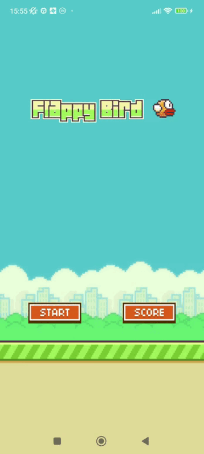

**[Readme на русском языке](README_RU.md)**  
  
[Dev blog in Telegram (ENG/RU)](https://t.me/boevdev)

# 🐦 Flappy Bird in C: APK Size < 100 Kilobytes! 🚀

## 📜 History:

It all started in 2021 when I stumbled upon [rawdrawandroid](https://github.com/cnlohr/rawdrawandroid). My goal was simple: to create a game with the minimal APK size, yet still be understandable and interesting. 🎯

The idea of making a Flappy Bird clone seemed logical, given that this game had already been ported to many languages. 🐤

In 2021, I also studied [Raylib](https://github.com/raysan5/raylib), but my first attempt to make a game in C++ using [ImGui](https://github.com/ocornut/imgui/) failed. 💔

The problems were everywhere: the APK size was around 1 MB, the game crashed, and the APK only contained the armeabi-v7a library (Google's 2022 requirements state that the arm64-v8a library must be included!). 🤯

## 💡 Motivation:

In September 2024, seeing Flappy Bird in C# in the Raylib Discord channel, I decided to try implementing this game in C for Android with an APK size of less than 100 KB. 🚀  

The idea seemed crazy, but the competitive interest took over. 💪

## 🛠️ Implementation:

I started by compiling a "Hello World" in C and packaging the library into an APK. 📦

Sounds were compressed to MP3 format, and OpenSLES was used for playback. 🎵

For PNG file decoding, I chose [upng](https://github.com/elanthis/upng). 🖼️

All of this was combined using OpenGL ES 2, shaders, and Android Native Activity. 🎮

## 🔧 Build:

### Visual Studio Code (Windows)

1. Create .env from .env.example
2. Run build.bat

### Linux and macOS (Makefile)

For Linux and macOS users, you can build the project using the provided Makefile:

1. Install the Android command-line tools.
2. Set up your environment variables in a `.env` file in the project root directory (see `.env.example` for an example).
3. Build the project:
   ```bash
   cd FlappyBird
   make
   ```
   
For more detailed instructions, please refer to [BUILDING.md](BUILDING.md).

The signed APK will be generated at:
`FlappyBird/app/build/outputs/apk/FlappyBird-signed.apk`

## 📄 Copyright:

I do not claim any copyright. The rights to the game and resources belong to **DotGEARS**. 📜

## 🌟 Inspiration:

- [rawdrawandroid](https://github.com/cnlohr/rawdrawandroid)
- [Flapper](https://github.com/its-Lyn/Flapper)
- [Raylib](https://github.com/raysan5/raylib)
- [ImGui](https://github.com/ocornut/imgui/)

## 🌠 Star History

[](https://star-history.dera.page/#VadimBoev/FlappyBird&Timeline)

---

🎉 Enjoy the game and don't forget to star it! 🌟
